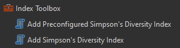
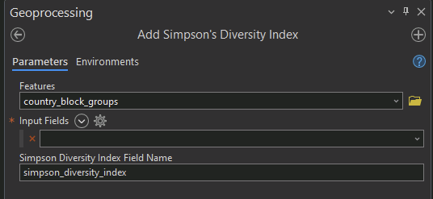
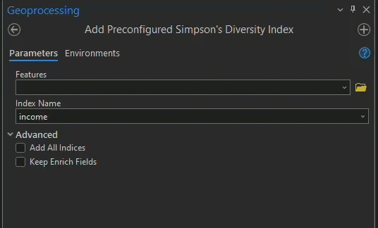

Simpson Index Toolbox
=============================================================================================================

The Simpson Index Toolbox includes two tools enabling calculation of the Gini-Simson Index for data with
existing columns with populations for respective categories, and selecting from pre-configured indices.
These pre-selected indices are calculated by enriching the input polygons using pre-selected demographic
variables available through ArcGIS Business Analyst, and using these variables to create a Gini-Simpson
Index.

    Simpson Index Toolbox

Add Simpson's Diversity Index
-------------------------------

The Add Simpson's Diversity Index tool takes an input Feature Layer with user specified columns containing
categorical population counts, and populates a new column added to the attribute table with a Gini-Simpson
Diversity Index calculated from the categorical population count columns.

    Add Simpson's Diversity Index tool

Add Preconfigured Simpsons's Diversity Index
----------------------------------------------

The Add Preconfigured Simpsons's Diversity Index tool provides the ability to create one or *all* of a selection
of preconfigured demographic indices calculated using pre-selected variables from the ArcGIS Business Analyst
United States dataset.

The available indices include.

- Income
- Home Value
- Wealth
- Age
- Home Age
- Employment Diversity
- Housing Diversity

The contributing variables from Business Analyst for each respective index are detailed below.

Income
^^^^^^^

.. list-table::
    :widths: 10 53
    :header-rows: 1

    * - variable_name
      - variable_alias
    * - HINC0_CY
      - 2022 HH Income <$15000
    * - HINC15_CY
      - 2022 HH Income $15000-24999
    * - HINC25_CY
      - 2022 HH Income $25000-34999
    * - HINC35_CY
      - 2022 HH Income $35000-49999
    * - HINC50_CY
      - 2022 HH Income $50000-74999
    * - HINC75_CY
      - 2022 HH Income $75000-99999
    * - HINC100_CY
      - 2022 HH Income $100000-149999
    * - HINC150_CY
      - 2022 HH Income $150000-199999
    * - HINC200_CY
      - 2022 HH Income $200000+

Home Value
^^^^^^^^^^

.. list-table::
    :widths: 10 53
    :header-rows: 1

    * - variable_name
      - variable_alias
    * - VAL0_CY
      - 2022 Home Value <$50000
    * - VAL50K_CY
      - 2022 Home Value $50K-99999
    * - VAL100K_CY
      - 2022 Home Value $100K-149999
    * - VAL150K_CY
      - 2022 Home Value $150K-199999
    * - VAL200K_CY
      - 2022 Home Value $200K-249999
    * - VAL250K_CY
      - 2022 Home Value $250K-299999
    * - VAL300K_CY
      - 2022 Home Value $300K-399999
    * - VAL400K_CY
      - 2022 Home Value $400K-499999
    * - VAL500K_CY
      - 2022 Home Value $500K-749999
    * - VAL750K_CY
      - 2022 Home Value $750K-999999
    * - VAL1M_CY
      - 2022 Home Value $1 Million-1499999
    * - VAL2M_CY
      - 2022 Home Value $2 Million+

Wealth
^^^^^^^

.. list-table::
    :widths: 10 53
    :header-rows: 1

    * - variable_name
      - variable_alias
    * - NW0_CY
      - 2022 Net Worth <$15000
    * - NW15_CY
      - 2022 Net Worth $15000-$34999
    * - NW35_CY
      - 2022 Net Worth $35000-$49999
    * - NW50_CY
      - 2022 Net Worth $50000-$74999
    * - NW75_CY
      - 2022 Net Worth $75000-$99999
    * - NW100_CY
      - 2022 Net Worth $100000-$149999
    * - NW150_CY
      - 2022 Net Worth $150000-$249999
    * - NW250_CY
      - 2022 Net Worth $250000-$499999
    * - NW500_CY
      - 2022 Net Worth $500000-$999999

Age
^^^^

.. list-table::
    :widths: 10 53
    :header-rows: 1

    * - variable_name
      - variable_alias
    * - POP0_CY
      - 2022 Population Age 0-4
    * - POP5_CY
      - 2022 Population Age 5-9
    * - POP10_CY
      - 2022 Population Age 10-14
    * - POP15_CY
      - 2022 Population Age 15-19
    * - POP20_CY
      - 2022 Population Age 20-24
    * - POP25_CY
      - 2022 Population Age 25-29
    * - POP30_CY
      - 2022 Population Age 30-34
    * - POP35_CY
      - 2022 Population Age 35-39
    * - POP40_CY
      - 2022 Population Age 40-44
    * - POP45_CY
      - 2022 Population Age 45-49
    * - POP50_CY
      - 2022 Population Age 50-54
    * - POP55_CY
      - 2022 Population Age 55-59
    * - POP60_CY
      - 2022 Population Age 60-64
    * - POP65_CY
      - 2022 Population Age 65-69
    * - POP70_CY
      - 2022 Population Age 70-74
    * - POP75_CY
      - 2022 Population Age 75-79
    * - POP80_CY
      - 2022 Population Age 80-84
    * - POP85_CY
      - 2022 Population Age 85+

Home Age
^^^^^^^^

.. list-table::
    :widths: 10 53
    :header-rows: 1

    * - variable_name
      - variable_alias
    * - ACSBLT2014
      - 2020 HUs/Year Built: 2014/Later (ACS 5-Yr)
    * - ACSBLT2010
      - 2020 HUs/Year Built: 2010-2013 (ACS 5-Yr)
    * - ACSBLT2000
      - 2020 HUs/Year Built: 2000-2009 (ACS 5-Yr)
    * - ACSBLT1990
      - 2020 HUs/Year Built: 1990-1999 (ACS 5-Yr)
    * - ACSBLT1980
      - 2020 HUs/Year Built: 1980-1989 (ACS 5-Yr)
    * - ACSBLT1970
      - 2020 HUs/Year Built: 1970-1979 (ACS 5-Yr)
    * - ACSBLT1960
      - 2020 HUs/Year Built: 1960-1969 (ACS 5-Yr)
    * - ACSBLT1950
      - 2020 HUs/Year Built: 1950-1959 (ACS 5-Yr)
    * - ACSBLT1940
      - 2020 HUs/Year Built: 1940-1949 (ACS 5-Yr)
    * - ACSBLT1939
      - 2020 HUs/Year Built: 1939 or Earlier (ACS 5-Yr)

Employment Diversity
^^^^^^^^^^^^^^^^^^^^^

.. list-table::
    :widths: 10 53
    :header-rows: 1

    * - variable_name
      - variable_alias
    * - INDAGRI_CY
      - 2022 Industry: Agriculture
    * - INDMIN_CY
      - 2022 Industry: Mining
    * - INDCONS_CY
      - 2022 Industry: Construction
    * - INDMANU_CY
      - 2022 Industry: Manufacturing
    * - INDWHTR_CY
      - 2022 Industry: Wholesale Trade
    * - INDRTTR_CY
      - 2022 Industry: Retail Trade
    * - INDTRAN_CY
      - 2022 Industry: Transportation
    * - INDUTIL_CY
      - 2022 Industry: Utilities
    * - INDINFO_CY
      - 2022 Industry: Information
    * - INDFIN_CY
      - 2022 Industry: Finance/Insurance
    * - INDRE_CY
      - 2022 Industry: Real Estate
    * - INDTECH_CY
      - 2022 Industry: Professional/Tech Svcs
    * - INDMGMT_CY
      - 2022 Industry: Management
    * - INDADMN_CY
      - 2022 Industry: Admin/Waste Mgmt
    * - INDEDUC_CY
      - 2022 Industry: Educational Services
    * - INDHLTH_CY
      - 2022 Industry: Health Care
    * - INDARTS_CY
      - 2022 Industry: Arts/Entertainment/Rec
    * - INDFOOD_CY
      - 2022 Industry: Accommodation/Food Svcs
    * - INDOTSV_CY
      - 2022 Industry: Other Services
    * - INDPUBL_CY
      - 2022 Industry: Public Administration

Housing Diversity
^^^^^^^^^^^^^^^^^^

.. list-table::
    :widths: 10 53
    :header-rows: 1

    * - variable_name
      - variable_alias
    * - ACSUNT1DET
      - 2020 Housing: 1 Detached Unit in Structure (ACS 5-Yr)
    * - ACSUNT1ATT
      - 2020 Housing: 1 Attached Unit in Structure (ACS 5-Yr)
    * - ACSUNT2
      - 2020 Housing: 2 Units in Structure (ACS 5-Yr)
    * - ACSUNT3
      - 2020 Housing: 3 or 4 Units in Structure (ACS 5-Yr)
    * - ACSUNT5
      - 2020 Housing: 5 to 9 Units in Structure (ACS 5-Yr)
    * - ACSUNT10
      - 2020 Housing: 10 to 19 Units in Structure (ACS 5-Yr)
    * - ACSUNT20
      - 2020 Housing: 20 to 49 Units in Structure (ACS 5-Yr)
    * - ACSUNT50UP
      - 2020 Housing: 50+ Units in Structure (ACS 5-Yr)
    * - ACSUNTMOB
      - 2020 Housing: Mobile Homes (ACS 5-Yr)
    * - ACSUNTOTH
      - 2020 Housing: Boat/RV/Van/etc. (ACS 5-Yr)
    * - ACSTOTHU
      - 2020 Total Housing Units (ACS 5-Yr)
